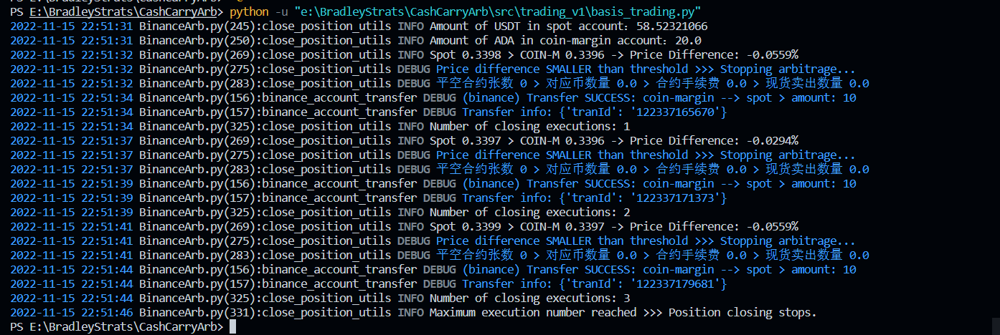
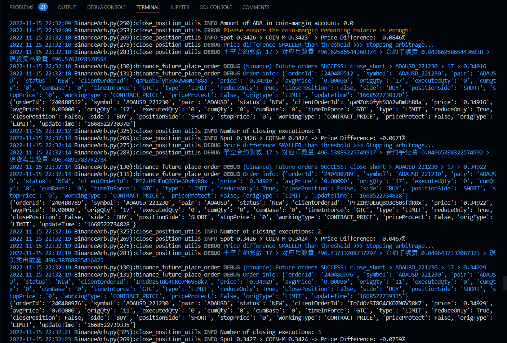

# Binance-Arbitrage
 Binance arbitrage bot using CCXT - opportunity detector & automated trading for cash-and-carry arbitrage

<div align=center>

</div>

## Basics

### 1. Arbitrage Process
1. Repeated detection for trading opportunity
2. Open positions:
   1. Open long in Spot account
   2. Universal account transfer：Spot account -> COIN-M Account
   3. Open short in COIN-M account
3. Close positions:
   1. Close short in COIN-M account
   2. Universal account transfer：COIN-M account -> Spot Account
   3. Close long in Spot account

### 2. Scripts
- `basis_trading.py`：Open/Close positions
- `Configs`: configuration
  - `Config.py`：Account & multiplier information
- `modules`：Collection of exchanges
  - `BinanceArb.py`: Arbitrage bot for Binance
- `utils`：
  - `Logger.py`：Logger configuration

## Getting Started

### 1. Install Prerequisites
1. `conda create -n binance_arb python=3.8`
2. `pip install ccxt`
3. `pip install urllib3==1.25.8`
4. install other required packages, such as pandas, coloredlogs
5. Check whether installation is successful:
```Python
import ccxt
exchange = ccxt.binance()
data = exchange.fetch_ticker(symbol='BTC/USDT')
print(data)
```

### 2. Fill in Hyperparameter for Arbitrage Bot
1. Fill your api key and secret in `Config.py`
2. Fill your hyperparameters in `basis_trading.py`


### 3. Execute Arbitrage
Simply run the following command in terminal:
```
python basis_trading.py --coin 'BTC' --future_date '221230' --amount 1000 --threshold 0.02
```
Adjust hyperparameters for your personal need. 

## Notes
The code is prepared with detailed comments and is well-organized for further extention (e.g. to other exchanges).

But take care of the following information before employment:
1. Open universal account transfer for your API
2. Check your [Multiplier for coin-margin](https://www.binance.com/zh-CN/futures/trading-rules/quarterly)
3. Check your [Trading fee](https://www.binance.com/en/fee/trading)
5. `TimeInForce`: choices for placing orders
   - GTC - Good Till Cancel 
   - IOC - Immediate or Cancel 
   - FOK - Fill or Kill 
   - GTX - Good Till Crossing 
6. Internet connections and error handling


## Arbitrage Sample
<div align=center>

</div>