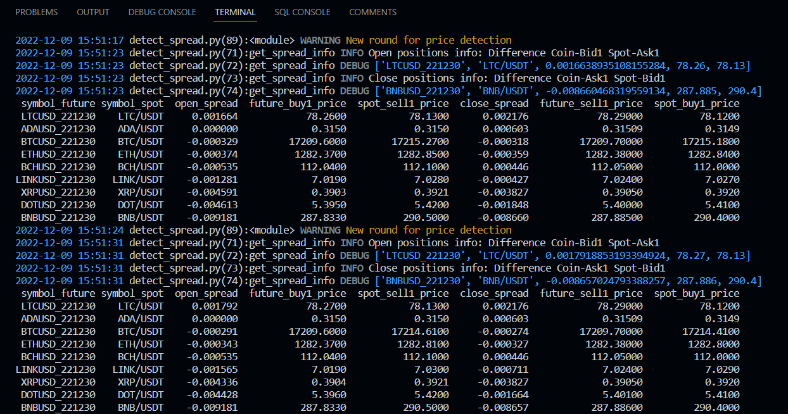

# Binance-Arbitrage
 Binance arbitrage bot using CCXT - opportunity detector & automated trading for cash-and-carry arbitrage



## Basics

### 1. Arbitrage Process
1. Repeated detection for trading opportunity
2. Open positions:
   1. Open long in Spot account
   2. Universal account transfer：Spot account -> COIN-M Account
   3. Open short in COIN-M account
3. Close positions:
   1. Close short in COIN-M account
   2. Universal account transfer：COIN-M account -> Spot Account
   3. Close long in Spot account

### 2. Scripts
- `Config.py`：Account & multiplier information
- `BinanceArb.py`: Arbitrage bot for Binance
- `Logger.py`：Logger configuration
- `detect_spread.py`：Spread detection
- `basis_trading.py`：Open/Close positions

## Getting Started

### 1. Install Prerequisites
1. Install CCXT:
   1. `conda create -n binance_arb python=3.8`
   2. `pip install ccxt`
   3. `pip install urllib3==1.25.8`
   4. Check whether installation is successful:
```Python
import ccxt
exchange = ccxt.binance()
data = exchange.fetch_ticker(symbol='BTC/USDT')
print(data)
```
2. Install other required packages, such as pandas, coloredlogs


### 2. Fill in Hyperparameters for Arbitrage Bot
1. Fill your api key and secret in `Config.py`
2. Change the hyperparameters in `detect_spread.py`
3. Change the hyperparameters in `basis_trading.py`


### 3. Execute Arbitrage
Run the following command in terminal:
```
# Price detection
python detect_spread.py

# Arbitrage trading
python basis_trading.py --coin 'BTC' --future_date '221230' --amount 1000 --threshold 0.02

# Hyperparameter settings:
    --coin                 Trading Target
    --future_date          expiration date for delivery contract
    --coin_precision       price precision (decimal points)
    --slippage             slippage (proportion of coin price)
    --spot_fee_rate        commission rate for spot
    --contract_fee_rate    commission rate for contract
    --max_trial            maximum trial for stable connections
    --amount               trading amount for one iteration
    --num_maximum          maximum execution numbers
    --threshold            opening/closing threshold
```
Adjust hyperparameters for your need.

## Notes
The code is well-organized for further extention to OKX, bitfinex, etc.

But take care of the following information before employment:
1. Open universal account transfer for your API
2. Check your [Multiplier for coin-margin](https://www.binance.com/zh-CN/futures/trading-rules/quarterly)
3. Check your [Trading fee](https://www.binance.com/en/fee/trading)
4. `TimeInForce`: choices for placing orders
   - GTC - Good Till Cancel 
   - IOC - Immediate or Cancel 
   - FOK - Fill or Kill 
   - GTX - Good Till Crossing 
5. Internet connections and error handling


## Real Trading Sample

**Account Transfer**


**Close Positions**


## License

Code released under the [MIT License](https://opensource.org/licenses/MIT).